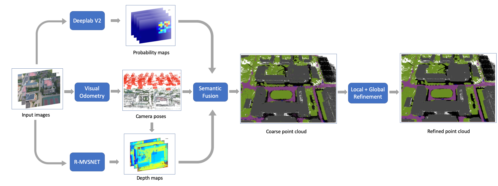
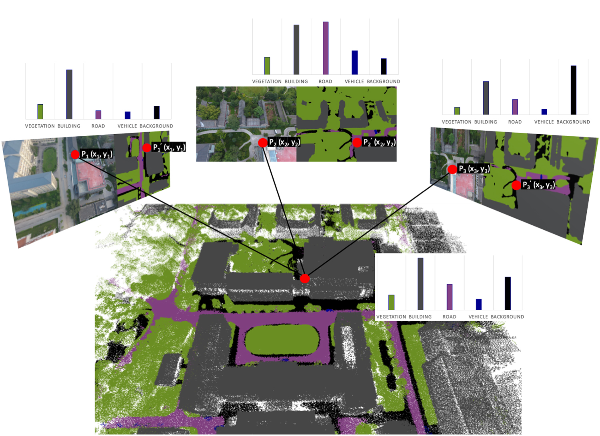

# Semantic-point-cloud

This repository contains the reference code for 3D point semantic post-process based on the following paper: [**Semantic 3D Reconstruction with Learning MVS and 2D Segmentation of Aerial Images**](https://www.mdpi.com/2076-3417/10/4/1275)

The PDF of the article is available at this [link](https://www.mdpi.com/2076-3417/10/4/1275/pdf).

## Abstract

Semantic modeling is a challenging task that has received widespread attention in recent years. With the help of mini Unmanned Aerial Vehicles (UAV), multi-view high-resolution aerial images of large-scale scenes can be conveniently collected. In this paper, we propose a semantic Multi-View Stereo (MVS) method to reconstruct 3D semantic models from 2D images. Firstly, 2D semantic probability distribution is obtained by Convolutional Neural Network (CNN). Secondly, the calibrated cameras poses are determined by Structure from Motion (SfM), while the depth maps are estimated by learning MVS. Combining 2D segmentation and 3D geometry information, dense point clouds with semantic labels are generated by a probability-based semantic fusion method. In the final stage, the coarse 3D semantic point cloud is optimized by both local and global refinements. By making full use of the Multi-View Consistency, the proposed method efficiently produces a fine-level 3D semantic point cloud. The experimental result evaluated by re-projection maps achieves 88.4% Pixel Accuracy on UDD dataset. In conclusion, our graph-based semantic fusion procedure and refinement based on local and global information can suppress and reduce the re-projection error. 

## Requirements

- Python 2.7 / 3.x

pip install -r requirements.txt

## Dataset

Here is a test set of images and its 3D dense vertices as the input.

[output.txt](https://drive.google.com/file/d/1uDi9g9tCDU4UuwJl1cv-7PrJzn_Ctc4C/view?usp=sharing)

[test Images](https://drive.google.com/file/d/1zio2ubkR-yPomp5n8zIvfDYB7S288rb4/view?usp=sharing)
